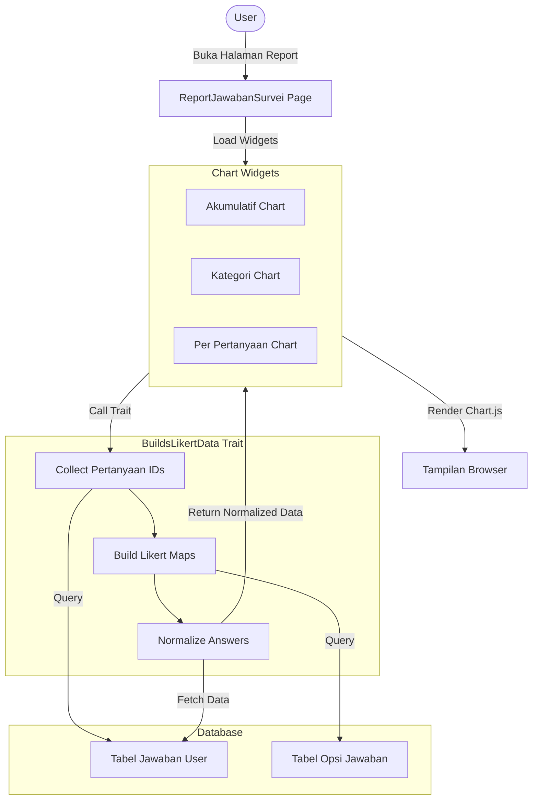
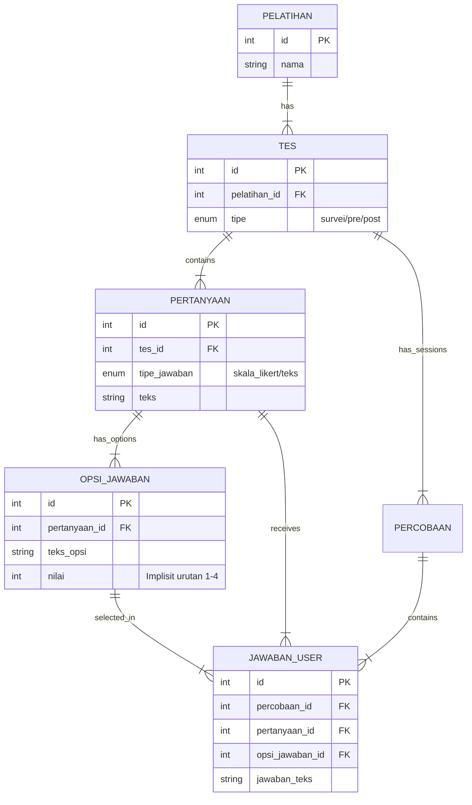

# Alur Implementasi Diagram Report Survey

Dokumen ini menjelaskan komponen, data, alur, dan struktur database yang digunakan untuk membuat **Report Survey** (Pie Chart Akumulatif, Stacked Bar Kategori, dan Pie Chart Per Pertanyaan).

## 1. Kebutuhan Komponen

Sistem menggunakan teknologi berikut:

-   **Filament PHP**: Admin panel.
-   **Chart.js**: Library visualisasi.
-   **Trait PHP (`BuildsLikertData`)**: Logic reusable pengolah data Likert.

## 2. File-File Terkait (Klik untuk membuka)

### Controller & Page

-   [ReportJawabanSurvei.php](html/php/ReportJawabanSurvei.php)
    -   _Fungsi_: Page controller, menerima `pelatihanId`.

### Widgets (Charts)

-   [JawabanAkumulatifChart.php](html\php\JawabanAkumulatifChart.php) (Pie Chart Total)
-   [JawabanPerKategoriChart.php](html\php\JawabanPerKategoriChart.php) (Stacked Bar Kategori)
-   [JawabanPerPertanyaanChart.php](html\php\JawabanPerPertanyaanChart.php) (Pie Chart per Soal)

### Logic & Trait

-   [BuildsLikertData.php](html\php\BuildsLikertData.php)
    -   _Core Logic_: Query DB, Normalisasi Data, Mapping Skala (1-4).

### Helper & View

-   [report-page.blade.php](html\php\report-page.blade.php)

## 3. Alur Logika (Flowchart)

Diagram alur bagaimana data diproses dari database hingga menjadi chart.

## 4. Struktur Database (ERD)

Relasi antar tabel yang mendukung fitur survei ini.

## 5. Metadata Data

-   **Input**: `pelatihanId` (URL Parameter).
-   **Filter Data**: Hanya pertanyaan dengan `topik_jawaban = 'skala_likert'` (untuk survei).
-   **Skala**:
    1.  Tidak Memuaskan
    2.  Kurang Memuaskan
    3.  Cukup Memuaskan
    4.  Sangat Memuaskan
