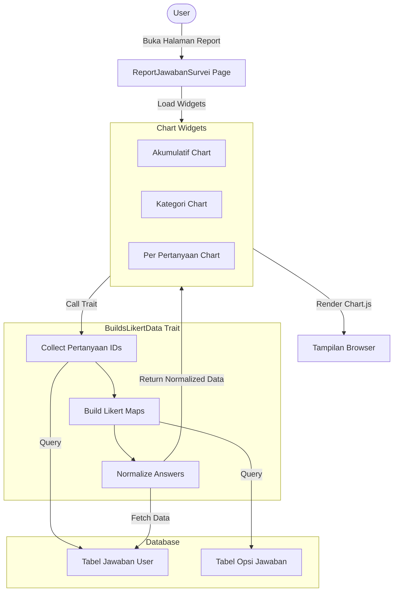
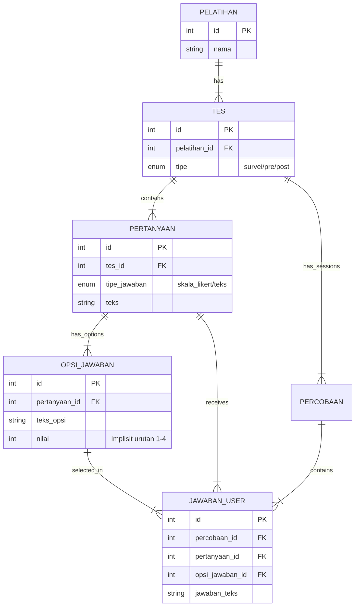

# 📊 Dokumentasi Teknis - Diagram Monev

Dokumen ini menjelaskan spesifikasi teknis, alur data, dan komponen yang diperlukan untuk merender **Laporan Hasil Evaluasi (Diagram Monev)**.

---

## 🏗️ 1. Arsitektur File

Berikut adalah file-file kunci yang menghubungkan Logic (Backend) dengan Visualisasi (Frontend).

### **Backend (Data Logic)**

-   **File**: `app/Filament/Clusters/Pelatihan/Resources/PelatihanResource/Pages/ViewMonevDetail.php`
-   **Tugas**:
    1.  Mengambil data mentah dari database.
    2.  Menghitung IKM (Indeks Kepuasan).
    3.  Mengelompokkan jawaban (Total, Per Kategori, Per Soal).
    4.  Mengirim variabel `$surveiData` ke view.

### **Frontend (UI & Chart)**

-   **File**: `resources/views/filament/clusters/pelatihan/resources/pelatihan-resource/pages/view-monev-detail.blade.php`
-   **Tugas**:
    1.  Menyiapkan Canvas HTML (`<canvas id="...">`).
    2.  Load library **Chart.js** (via CDN).
    3.  Load library **Alpine.js** untuk reaktivitas.
    4.  Render grafik berdasarkan data `$surveiData`.

---

## 🗄️ 2. Skema Database

Tabel-tabel database yang harus ada dan saling berelasi:

| Model / Tabel             | Keterangan                                       |
| :------------------------ | :----------------------------------------------- |
| **`Pelatihan`**           | Tabel induk kegiatan.                            |
| **`KompetensiPelatihan`** | Spesialisasi pelatihan (Kejuruan).               |
| **`Tes`**                 | Header kuis/survei (`tipe = 'survei'`).          |
| **`Pertanyaan`**          | Soal survei (`tipe_jawaban = 'skala_likert'`).   |
| **`OpsiJawaban`**         | Pilihan skor (Ex: 1=Buruk ... 4=Sangat Baik).    |
| **`JawabanUser`**         | **Tabel Utama**. Menyimpan skor jawaban peserta. |

---

## 🔄 3. Alur Proses (Flowchart)

Berikut visualisasi bagaimana data diproses dari Database hingga tampil menjadi Grafik.

```mermaid
flowchart TD
    %% Nodes
    DB[(Database)]
    CTRL[Controller (PHP)]
    LOGIC[Data Processing]
    VIEW[Blade View]
    JS[Chart.js / Alpine]
    UI[Browser User]

    %% Flow
    DB -- "1. Query JawabanUser" --> CTRL
    CTRL -- "2. Collection Data" --> LOGIC

    subgraph PROCESS [Proses Kalkulasi]
        direction TB
        LOGIC -- "Normalisasi Skor (1-4)" --> LOGIC
        LOGIC -- "Hitung Rata-rata IKM" --> LOGIC
        LOGIC -- "Grouping Breakdown Label" --> LOGIC
    end

    LOGIC -- "3. $surveiData (Array)" --> VIEW
    VIEW -- "4. JSON Injection" --> JS
    JS -- "5. Render Canvas" --> UI

    %% Styling
    style DB fill:#e1f5fe,stroke:#01579b
    style PROCESS fill:#fff3e0,stroke:#e65100,stroke-dasharray: 5 5
    style JS fill:#f3e5f5,stroke:#4a148c
```

---

## 📦 4. Struktur Data Output

Variabel `$surveiData` yang dikirim ke frontend memiliki struktur array sebagai berikut:

```php
[
    // Skor Utama
    'ikm' => 91.3,                   // Nilai Indeks (0-100)
    'ikm_category' => 'SANGAT BAIK', // Predikat Teks

    // Chart 1: Doughnut (Total Akumulasi)
    'total_chart' => [
        'datasets' => [
            [
                'data' => [5, 10, 50, 100] // [Total Skor 1, Skor 2, Skor 3, Skor 4]
            ]
        ]
    ],

    // Chart 2: Stacked Bar (Per Kategori)
    'category_chart' => [
        'labels' => ['Pelayanan', 'Fasilitas', 'Materi'], // Sumbu Y
        'datasets' => [
            ['label' => 'Kurang', 'data' => [...]],
            ['label' => 'Baik', 'data' => [...]],
            // ... dst untuk setiap seri warna
        ]
    ],

    // Chart 3: Pie Charts (Per Pertanyaan)
    'question_stats' => [
        'Pelayanan' => [ // Group by Kategori
            [
                'id' => 123,
                'teks' => 'Bagaimana pelayanan panitia?',
                'data' => [1, 2, 40, 50] // Distribusi jawaban spesifik soal ini
            ],
            // ... soal berikutnya
        ]
    ]
]
```

---

# 📜 Detail Alur Implementasi (Referensi Legacy)

Berikut adalah detail implementasi tambahan yang merujuk pada alur komponen `Widget` dan `Trait` yang digunakan dalam sistem pelaporan.

## 1. Kebutuhan Komponen

Sistem menggunakan teknologi berikut:

-   **Filament PHP**: Admin panel.
-   **Chart.js**: Library visualisasi.
-   **Trait PHP (`BuildsLikertData`)**: Logic reusable pengolah data Likert.

## 2. File-File Terkait

### Controller & Page

-   **`ReportJawabanSurvei.php`**: Page controller, menerima `pelatihanId`.

### Widgets (Charts)

-   **`JawabanAkumulatifChart.php`**: Pie Chart Total.
-   **`JawabanPerKategoriChart.php`**: Stacked Bar Kategori.
-   **`JawabanPerPertanyaanChart.php`**: Pie Chart per Soal.

### Logic & Trait

-   **`BuildsLikertData.php`**: _Core Logic_ untuk Query DB, Normalisasi Data, dan Mapping Skala (1-4).

### Helper & View

-   **`report-page.blade.php`**: Tampilan halaman report.

## 3. Alur Logika (Flowchart Detail)

Diagram alur bagaimana data diproses dari database hingga menjadi chart menggunakan Widgets.



## 4. Struktur Database (ERD Detail)

Relasi antar tabel yang mendukung fitur survei ini.



## 5. Metadata Data

-   **Input**: `pelatihanId` (URL Parameter).
-   **Filter Data**: Hanya pertanyaan dengan `tipe_jawaban = 'skala_likert'` (untuk survei).
-   **Skala**:
    1.  Tidak Memuaskan
    2.  Kurang Memuaskan
    3.  Cukup Memuaskan
    4.  Sangat Memuaskan
