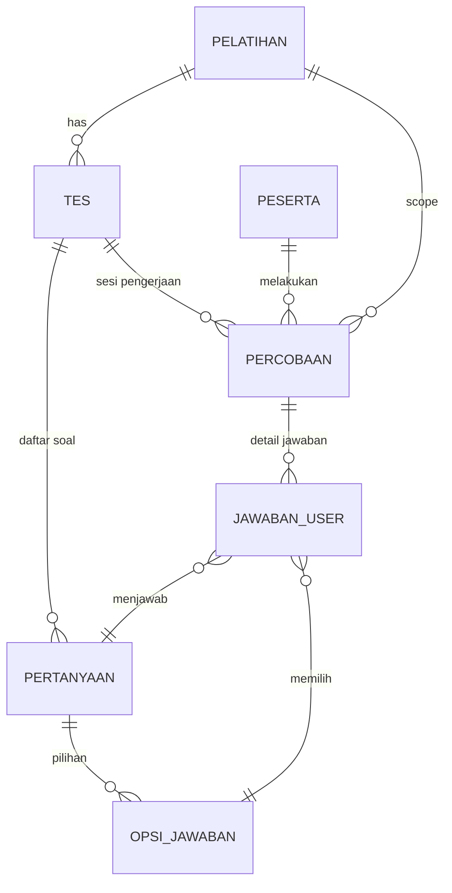

# Alur Proses: Pelatihan -> Tes -> Monev

Dokumen ini menjelaskan alur teknis mulai dari pembuatan pelatihan, pembuatan tes (pre/post), pengerjaan tes oleh peserta, hingga pengisian survei MONEV. Disertakan juga referensi model dan kolom tabel yang digunakan secara eksplisit.

---

## 1. Pembuatan Pelatihan (Admin)

Proses ini dilakukan oleh Administrator melalui panel admin (Filament) untuk membuat data kelas pelatihan baru.

-   **Fitur**: `PelatihanResource` / `CreatePelatihan`
-   **Model Utama**: `App\Models\Pelatihan`
-   **Tabel**: `pelatihan`

**Kolom Penting yang Digunakan:**

| Kolom             | Tipe   | Deskripsi                                         |
| :---------------- | :----- | :------------------------------------------------ |
| `id`              | PK     | ID Pelatihan                                      |
| `nama_pelatihan`  | String | Nama/Judul Pelatihan                              |
| `instansi_id`     | FK     | Relasi ke instansi penyelenggara                  |
| `jenis_program`   | Enum   | Jenis program pelatihan                           |
| `tanggal_mulai`   | Date   | Menentukan kapan pelatihan (dan tes) bisa dimulai |
| `tanggal_selesai` | Date   | Batas akhir pelatihan                             |
| `status`          | String | Status dinamis (aktif/selesai) berbasis tanggal   |
| `slug`            | String | URL friendly slug                                 |

---

## 2. Pembuatan Tes (Pre-Test, Post-Test, Survei/Monev)

Setelah pelatihan dibuat, Admin membuat paket soal (Tes). Satu pelatihan bisa memiliki Pre-Test, Post-Test, dan Survei (Monev).

-   **Fitur**: `TesResource` / `CreateTes`
-   **Model Utama**: `App\Models\Tes`, `App\Models\Pertanyaan`
-   **Tabel**: `tes`, `pertanyaan`

### A. Model `Tes` (Tabel `tes`)

| Kolom             | Tipe     | Deskripsi                                                     |
| :---------------- | :------- | :------------------------------------------------------------ |
| `id`              | PK       | ID Tes                                                        |
| `pelatihan_id`    | FK       | Mengaitkan tes ke pelatihan tertentu                          |
| `judul`           | String   | Judul tes (mis: "Pre-Test Pelatihan X")                       |
| `tipe`            | Enum     | Penanda jenis: `pre-test`, `post-test`, atau `survei` (Monev) |
| `durasi_menit`    | Integer  | Batas waktu pengerjaan                                        |
| `passing_score`   | Integer  | Nilai ambang batas kelulusan                                  |
| `tanggal_mulai`   | Datetime | Kapan tes dibuka                                              |
| `tanggal_selesai` | Datetime | Kapan tes ditutup                                             |

### B. Model `Pertanyaan` (Tabel `pertanyaan`)

Pertanyaan dibuat terhubung dengan `tes_id`.

| Kolom             | Tipe    | Deskripsi                                                                                 |
| :---------------- | :------ | :---------------------------------------------------------------------------------------- |
| `id`              | PK      | ID Pertanyaan                                                                             |
| `tes_id`          | FK      | Relasi ke Tes                                                                             |
| `teks_pertanyaan` | Text    | Isi soal                                                                                  |
| `tipe_jawaban`    | Enum    | `pilihan_ganda` (tes) atau `skala_likert` (monev)                                         |
| `kategori`        | String  | (Penting untuk **Monev**) Mengelompokkan aspek penilaian (mis: "Instruktur", "Fasilitas") |
| `nomor`           | Integer | Urutan soal                                                                               |

---

## 3. Pengerjaan Tes (Peserta)

Peserta mengerjakan tes (Pre/Post) melalui Dashboard Peserta. Alur ini dikelola oleh `DashboardController`.

-   **Controller**: `App\Http\Controllers\DashboardController`
-   **Model Utama**: `App\Models\Percobaan`, `App\Models\JawabanUser`

### Alur Pengerjaan:

1.  **Mulai (`startByTes`)**:
    -   Sistem mengecek sesi peserta (`peserta_id`).
    -   Membuat _record_ baru di tabel `percobaan` untuk mencatat sesi pengerjaan.
2.  **Jawab Soal (`submit`)**:
    -   Setiap jawaban yang dikirim disimpan ke tabel `jawaban_user`.
3.  **Selesai**:
    -   Sistem menghitung skor dan memperbarui kolom `skor`, `lulus`, dan `waktu_selesai` di tabel `percobaan`.

### A. Model `Percobaan` (Tabel `percobaan`)

Mencatat satu sesi pengerjaan tes oleh peserta.

| Kolom           | Tipe     | Deskripsi                                          |
| :-------------- | :------- | :------------------------------------------------- |
| `id`            | PK       | ID riwayat pengerjaan                              |
| `peserta_id`    | FK       | Peserta yang mengerjakan                           |
| `tes_id`        | FK       | Tes yang dikerjakan                                |
| `pelatihan_id`  | FK       | Konteks pelatihan saat tes dikerjakan              |
| `tipe`          | String   | Salinan tipe tes (`pre-test`/`post-test`/`survei`) |
| `waktu_mulai`   | Datetime | Waktu klik "Mulai"                                 |
| `waktu_selesai` | Datetime | Waktu selesai/submit                               |
| `skor`          | Decimal  | Nilai akhir (0-100)                                |
| `lulus`         | Boolean  | Status kelulusan berdasarkan `passing_score`       |

### B. Model `JawabanUser` (Tabel `jawaban_user`)

Menyimpan rincian jawaban per soal.

| Kolom             | Tipe  | Deskripsi                                        |
| :---------------- | :---- | :----------------------------------------------- |
| `percobaan_id`    | FK    | Relasi ke sesi `percobaan`                       |
| `pertanyaan_id`   | FK    | Relasi ke soal yang dijawab                      |
| `opsi_jawaban_id` | FK    | Pilihan yang dipilih (jika pilihan ganda/likert) |
| `nilai_jawaban`   | Float | Nilai bobot jawaban (opsional)                   |
| `jawaban_teks`    | Text  | Isi jawaban (jika esai)                          |

---

## 4. Pengerjaan Survei Monev (Peserta)

Monev (Monitoring & Evaluasi) secara teknis menggunakan alur yang **sama** dengan Tes, namun dengan `tipe = 'survei'` dan visualisasi hasil yang berbeda.

-   **Lokasi Fitur**: Dashboard Peserta -> Menu Monev
-   **Controller**: `DashboardController` (method `monev`, `monevStart`, `monevSubmit`)

### Perbedaan Teknis dengan Tes Biasa:

1.  **Identifikasi Monev**:
    -   Sistem mencari record di tabel `tes` dimana `tipe = 'survei'` dan `pelatihan_id` sesuai dengan sesi user.
2.  **Pengerjaan**:
    -   Menggunakan tabel `percobaan` dan `jawaban_user` yang sama.
    -   Namun, model `Pertanyaan` biasanya bertipe `skala_likert`.
3.  **Pelaporan (ViewMonevDetail)**:
    -   Hasil Monev tidak dilihat sebagai "Skor Lulus/Gagal".
    -   Hasil ditarik dari table `jawaban_user`, dikelompokkan berdasarkan kolom `pertanyaan.kategori`, dan dihitung rata-rata skala Likert-nya.

**Mapping Komponen Monev:**

| Komponen Monev           | Implementasi Database                                                             |
| :----------------------- | :-------------------------------------------------------------------------------- |
| **Form Survei**          | Tabel `tes` (tipe='survei')                                                       |
| **Pertanyaan Kuesioner** | Tabel `pertanyaan` (tipe_jawaban='skala_likert', kategori='Fasilitas/Materi/dll') |
| **Responden**            | Tabel `percobaan` (menghubungkan `peserta_id` ke survei ini)                      |
| **Isi Kuesioner**        | Tabel `jawaban_user` (menyimpan skala 1-4 yang dipilih)                           |

---

## Ringkasan Relasi Tabel

---

## Identifikasi Perbedaan & Potensi Efisiensi (Proposed vs Existing)

Berdasarkan perbandingan dengan struktur yang diajukan (`proposed-tes.md`), berikut adalah identifikasi perbedaan utama dan analisis efisiensinya:

### 1. Konsep "Bank Soal" (Many-to-Many vs One-to-Many)

-   **Existing (`alur-tes-2.md`)**: Menggunakan relasi **One-to-Many** (`tes_id` ada di tabel `pertanyaan`). Artinya, setiap pertanyaan _milik eksklusif_ satu tes. Jika ada soal yang sama di Pre-Test dan Post-Test, soal tersebut harus diduplikasi.
-   **Proposed**: Menggunakan relasi **Many-to-Many** dengan tabel pivot `pertanyaan_tes`. Tabel `pertanyaan` berdiri sendiri sebagai "Bank Soal".
-   **Rekomendasi Efisiensi**: Struktur **Proposed** lebih efisien untuk manajemen bank soal jangka panjang, karena memungkinkan satu pertanyaan digunakan kembali di berbagai tes (misal: soal yang sama untuk Pre-Test ditarik lagi di Post-Test tanpa duplikasi data).

### 2. Standarisasi Opsi Jawaban (Bank Opsi)

-   **Existing**: Opsi jawaban (`opsi_jawaban`) terikat langsung ke satu `pertanyaan`. Setiap pertanyaan punya opsi masing-masing, meskipun opsinya standar (misal: skala Likert 1-4).
-   **Proposed**: Memperkenalkan tabel `kelompok_opsi` dan relasi ke `opsi_jawaban`. Pertanyaan hanya menunjuk ke `id_kelompok_opsi` (jika diperlukan) atau tetap punya opsi spesifik.
-   **Rekomendasi Efisiensi**: Struktur **Proposed** sangat efisien untuk **Survei/Monev**. Kita cukup membuat satu kelompok opsi "Skala Kepuasan (1-4)" dan menggunakannya untuk 50 pertanyaan survei, daripada membuat 200 record opsi jawaban (4 opsi x 50 pertanyaan) yang berulang-ulang.

### 3. Kesimpulan Identifikasi

Struktur yang diajukan di `proposed-tes.md` menawarkan **normalisasi data yang lebih baik** untuk skalabilitas:

1.  **Deduplikasi Pertanyaan**: Menghemat _storage_ dan mempermudah _maintenance_ soal (edit satu soal, terupdate di semua tes).
2.  **Efisiensi Opsi Survei**: Mengurangi baris data opsi jawaban secara signifikan untuk kuesioner berskala standar.

_Catatan: Implementasi perubahan ini memerlukan migrasi struktur database yang cukup masif pada tabel `pertanyaan` (menghapus `tes_id`, menambah pivot) dan `opsi_jawaban` (menambah konsep kelompok)._
